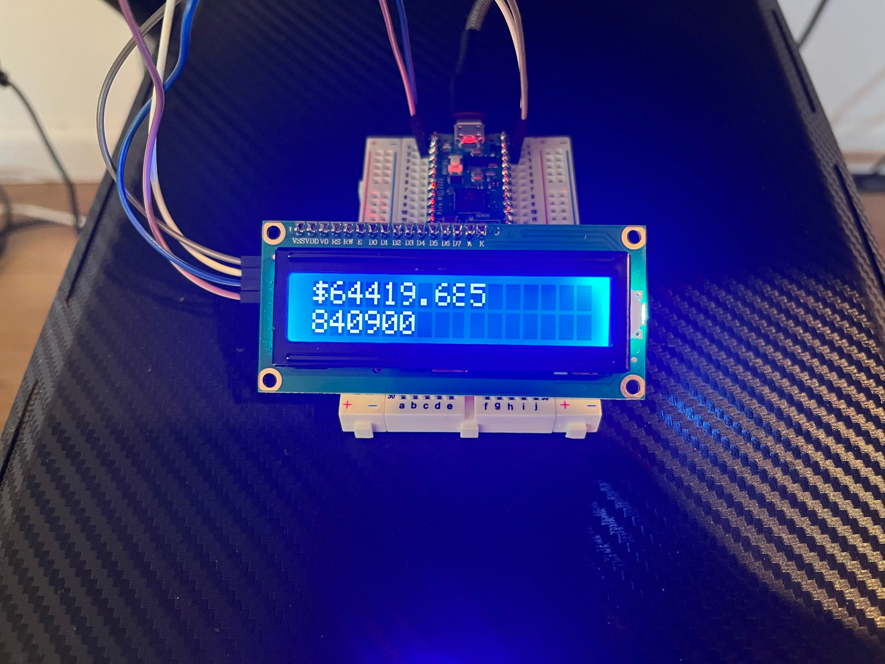
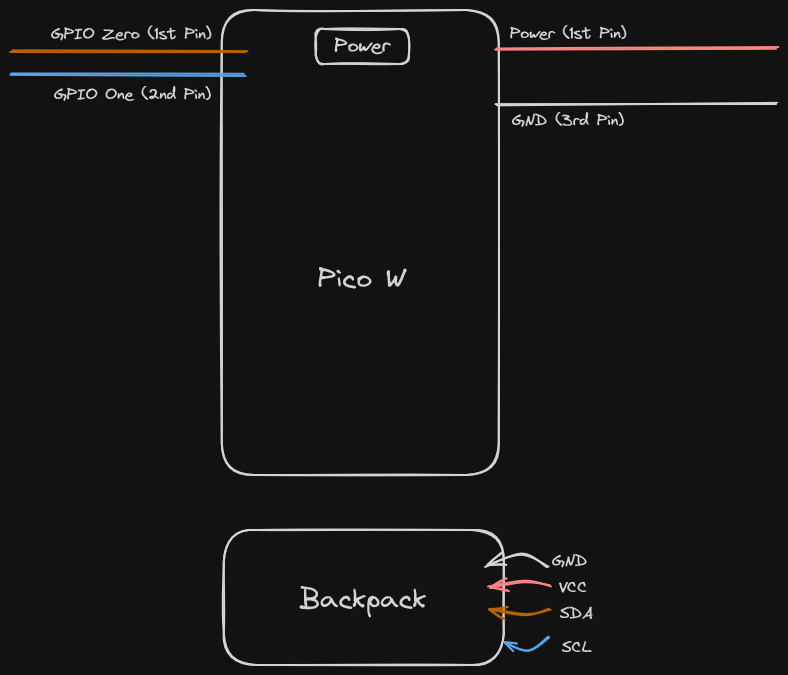

#### Bitcoin Feed with Raspberry Pi Pico W and I2C 1602 Display

Programs a Pico to fetch the price and block height every minute and displays the data from the I2C interface to an LCD screen.



#### The Parts

- [x] [Raspberry Pi Pico W](https://www.amazon.com/Pico-Raspberry-Pre-Soldered-Dual-core-Processor/dp/B0BK9W4H2Q/ref=sr_1_4?crid=1BHUD894SXLEH&dib=eyJ2IjoiMSJ9.fwbQmoH_WONpf6FqMJoavUFIlwWdZydA1wDrREtCQjcxpQnpHVlkSc1ljXlQuOBEviXrW4IK106l5JvpCLEja--yFZU8SGRD3T_wjiJAFxKM5GSTWO1xdDx5nZ-rYSHC21FwKRNQlFgQcn5-XzRR1ZrzulI2UPfomvRnE0cRPiaoN-nmUq9IyTSQyWN69AS8GxU2N7LFDTjK4IaJkac7zaWjeddaIrQCrCGlFFigtJiEycsVuzDvQUpQnJDB1FJWxhdN2R9ZIE3Io5OzS38CQ_UvbpS2_wgMlvNXRdJwXLg.d6B0Ne6Lc64tG7EGnWtVvx4APMNi102AARYgU-ui-gE&dib_tag=se&keywords=raspberry+pi+pico+w&qid=1714100199&s=electronics&sprefix=raspberry+pi+pico+%2Celectronics%2C180&sr=1-4) with pre-soldered header pins

- [x] [1602 LCD Display Module](https://www.amazon.com/GeeekPi-Character-Backlight-Raspberry-Electrical/dp/B07S7PJYM6/ref=sr_1_3?crid=1B9K8V0M4JIU4&dib=eyJ2IjoiMSJ9.NHHShKxQ3uIocjrDetOFyu5kBGo87N4pCyU6pLU4Nshz_xyNWSktruDgVruT0alISbyHAC5mxLz0kionSfPYZsHcIdPxtQjfhM6c8vF9feu1gtOOF2qDRMsWud3jXDMGSOzA7ft2m9hl58tTWlx1zhHCMhcEJxzh-bx4iNHVsC8dXtLCIiWiqydeUULa_lTBH6oze_gJIX_aUtKJgPzWUeK48bMzMzdik7e1MpD-YfdIyvfMV5HYl_Uy8fHoKoLfKbnBSsWcvplpg07atbZ7mt0bYZThQ1tG3poLsujain8.5cSX_XI26JSxs8oe_5xHTf455_z1YmYRan-mku4bTqA&dib_tag=se&keywords=2x16+lcd+display+i2c&qid=1714100237&s=electronics&sprefix=2x16+lcd+display+i2c%2Celectronics%2C172&sr=1-3) with 4 pin SDA/SCL backpack

- [x] [A breadboard](https://www.amazon.com/DEYUE-breadboard-Set-Prototype-Board/dp/B07LFD4LT6/ref=sr_1_3?crid=3CP9E85VB8HEP&dib=eyJ2IjoiMSJ9.0XjhQpvsxVGvVwki4XDjTQ1NwlQgUbmPkISrVDMlHvUJ74nv754rZAUCzJ7kgtUD3pwxm_bdXd9CvmXk3eP9z8Hs6wBFZ3t31iQ3SytGpxhaeIJrTYczfOZXE9dn7B353NM52FY6EduYHq_CP1fis8hEgaYYCEcbGgVij5eG0rgxuQ65_sA4ZsNV2wHVewG-mE7crDHzR6adIwMFdld8t-kzynZ08loLt898wE2MZV0.ltFF8MNyt17sx_ArWk2oZCnFgjZZkSZMOKdIssk-UJ4&dib_tag=se&keywords=breadboard&qid=1714100724&sprefix=breadboar%2Caps%2C275&sr=8-3)

- [x] [Male to female jumper wires](https://www.amazon.com/Elegoo-EL-CP-004-Multicolored-Breadboard-arduino/dp/B01EV70C78/ref=sr_1_3?crid=26CZV37H2KD90&dib=eyJ2IjoiMSJ9.1JTtZYzqh1JVSNxn_zOlNMNRLxFT2KI-nY_HZ8AEBLUGfAf_2KcjXo9ROFkGCOp88Xpy0he-jUG-HQV-vDVDGyp71LrqMw_SwC37FnCAa1xvRxftg1JLnGJcDH0G1ZE3KHfxu-oRkGCizPwggeekczIV3lLfOvsJk66z2h3nk2eR8hklNHhAoGm5UZbNi3qSqVAI9lwynSeEM64bH8X60wc4-XFfIW09IBJNhvX9Ah8.CJcJY3L8iZ4Yyh0oULjU7Ixc25__aC55mgfDCCZgrSE&dib_tag=se&keywords=breadboard+jumper+wires&qid=1714100776&sprefix=breadboard+jumper+%2Caps%2C220&sr=8-3)

- [x] Standard USB cable with data relay

- [x] External power for standalone setup

#### Breadboard Wiring



#### Getting Started

`git clone https://github.com/rustaceanrob/picofeed.git`

`cd picofeed`

The preferred method of bootstrapping the setup is the [Thonny](https://thonny.org/) micropython editor. To download micropython, open Thonny and connect the Pico to the USB cable, select `Run > Configure Interpreter` and download micropython for the Pico W target. Alter `main.py` lines 9 and 10, filling in your WiFi name (display name) and password, so your Pico can connect to the local network.

```python
ssid = ''
password = ''
```

To run the program when the breadboard wiring is setup to the LCD interface, open Thonny, connect the Pico to the USB and navigate to `File > Save Copy`. Save each `.py` file to the Pico. Finally, select `Run > Run Current Script`.

